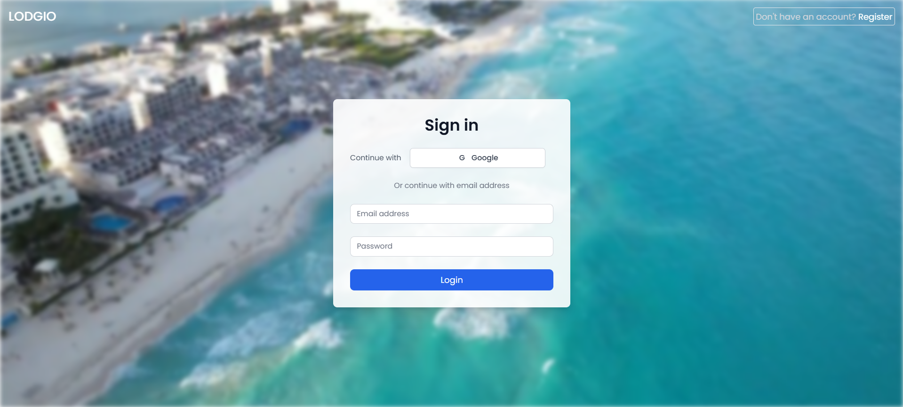
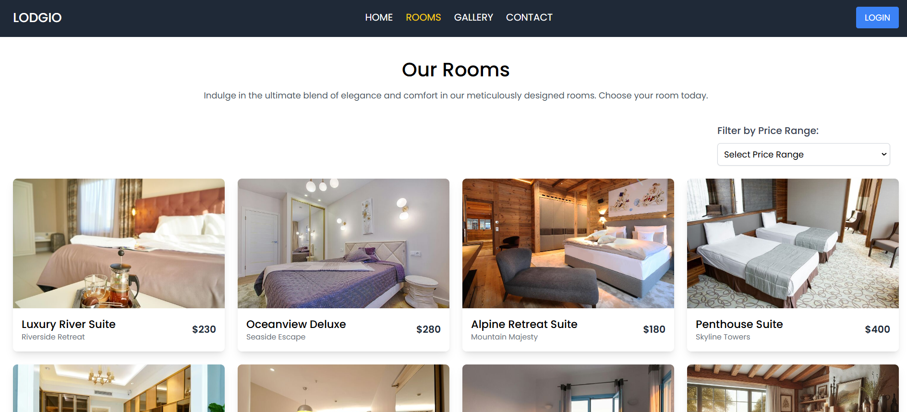

# Lodgio - Frontend

## Project Purpose
Lodgio simplifies hotel booking with an intuitive, responsive interface for browsing, booking, and managing accommodations.

## Live URL
[Live Demo](https://lodgio.netlify.app)

## Screenshots
 

## Key Features
- **Responsive Design:** Fully responsive UI with light and dark mode support.
- **Hotel Listings:** Display hotels with details such as name, location, and price.
- **User Authentication:** Firebase authentication for secure login and signup.
- **Interactive Gallery:** View high-quality images of the hotel.
- **Real-Time Search:** Find hotels using filters and search functionality.

## NPM Packages Used
- **React:** Frontend library for building user interfaces.
- **React Router DOM:** Routing for dynamic navigation.
- **Tailwind CSS:** Utility-first CSS framework for styling.
- **React Icons:** For adding visually appealing icons.
- **React Toastify:** Notifications for user feedback.
- **Framer Motion:** Smooth animations.
- **GSAP:** Animation for slider.
- **React Leaflet:** For map on Homepage.
- **React Slick:** For review carousel.
- **React Helmet:** For custom title and metadata.
- **Moment JS:** For date updates.
- **Axios:** For making HTTP requests.
- **Date-fns:** For date manipulation.
- **Firebase:** For authentication and data handling.
- **Sweetalert2:** For elegant alerts and modals.
- **Slick Carousel:** For image and review carousel.

---

## Local Setup Guide:

### 1. Clone the repository:
Clone the project repository to your local machine by running the following command in your terminal:

```bash
git clone https://github.com/emran-binhasan/dev-emran.git

---
## Local Setup Guide:

### 1. Clone the repository:
Clone the project repository to your local machine by running the following command in your terminal:

git clone https://github.com/emran-binhasan/dev-emran.git


### 2. Navigate to the project directory:
Once the repository is cloned, navigate into the project folder:

cd <your-project-folder>

### 3. Install dependencies:
Install all the necessary dependencies for the project by running:

npm install


### 5. Run the local development server:
After installing the dependencies and setting up any environment variables, start the local development server by running:

npm run dev

By default, the project will be available at `http://localhost:3000`.


